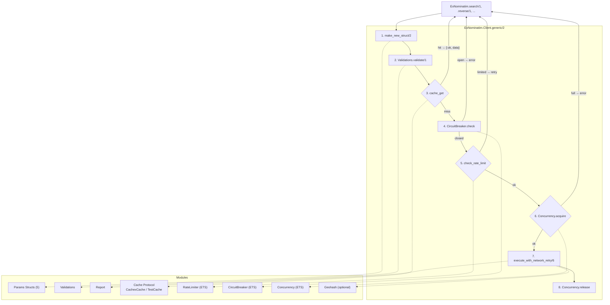
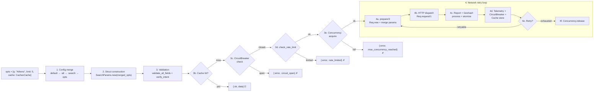

# ExNominatim — Design Document

## Overview

ExNominatim is a stateless Elixir client for the [Nominatim API V1](https://nominatim.org/release-docs/latest/api/Overview/) that wraps all five public endpoints (`/search`, `/reverse`, `/lookup`, `/details`, `/status`) in a validated, pipeline-based API. Its primary architectural characteristic is **validate-then-dispatch**: every request is parsed into a typed struct, validated against the API specification (including cross-field intent checks), and only then converted to an HTTP request. The library prevents invalid API calls at the boundary and returns structured `{:ok, map}` / `{:error, map}` tuples rather than raw HTTP responses.

## Architecture



## Module Responsibilities

### ExNominatim (`lib/ex_nominatim.ex`)

The public API surface. Delegates all calls to `ExNominatim.Client` and provides `get_config/0` to inspect merged configuration. Holds the default config (public server URL, `force: false`, `process: true`, `atomize: true`, per-endpoint format overrides). Documents the configuration precedence: `default < :all < endpoint-specific < opts`.

### ExNominatim.Client (`lib/client.ex`)

The pipeline orchestrator. Contains `generic/2` which sequences the full request lifecycle: struct creation → validation → **cache lookup** → **circuit breaker check** → **rate limit check** → **concurrency limiter** → HTTP preparation → dispatch → **network retry loop** → report processing → **cache store**. The `cache_get/2` and `cache_store/2` helpers interact with any module implementing the `ExNominatim.Cache` protocol. The `check_rate_limit/1` helper delegates to `ExNominatim.RateLimiter` based on the `:rate_limit` config option. The `execute_with_network_retry/6` function runs the HTTP call inside a retry loop with exponential backoff and jitter for transport errors, 5xx, and 429 responses. Also houses `prepare/3` (builds `Req.Request` with User-Agent header, URL validation, query param filtering) and `new/3` (validates required fields, constructs struct from merged opts). The `get_module/1` helper resolves endpoint atoms to params modules via `Module.safe_concat/1`.

### ExNominatim.Validations (`lib/validations.ex`)

The validation engine. Every field has a `valid?/2` clause that checks type, range, format, and membership against API specs. Cross-field intent validation (`verify_intent/1`) enforces mutually exclusive modes (e.g., freeform `:q` vs. structured search fields; `:place_id` vs. `:osmtype`/`:osmid`). Errors accumulate in `%{valid?: false, errors: [{key, message}]}`. Also provides `explain_fields/0` and `sanitize_comma_separated_strings/1`.

### ExNominatim.Report (`lib/report.ex`)

Response normalization. `process/1` pattern-matches on `Req.Response` to detect HTTP-level and API-level errors (embedded `"error"` key in JSON or `<error>` in XML). `atomize/1` recursively converts binary map keys to atoms (with dash→underscore normalization), handling nested maps, lists, and structs.

### ExNominatim.Cache Protocol (`lib/cache.ex`, `lib/cache_atom.ex`)

Defines the `get/2`, `put/3`, `del/2` protocol that any cache adapter must implement. Ships with two implementations:

- `ExNominatim.CachexCache` — wraps Cachex `Actions.get/3`, `Actions.put/4`, `Actions.del/2` for production use.
- `for: Atom` — delegates to a module's `get/1`, `put/3`, `del/2` via `apply/3` at runtime, enabling lightweight test adapters like `ExNominatim.TestCache`.

The protocol is designed so that `cache: nil` (default) skips all cache operations with `:miss` in `generic/2`, imposing zero overhead when caching is not configured.

### Params Structs (`lib/client/*_params.ex`)

Five modules — `SearchParams`, `ReverseParams`, `LookupParams`, `DetailsParams`, `StatusParams` — each defining a `defstruct` with endpoint-specific fields plus the shared `valid?` and `errors` validation accumulator. Each declares `@required` fields and delegates `new/1` to `Client.new/3`.

### ExNominatim.RateLimiter (`lib/rate_limiter.ex`)

Best-effort per-server rate limiter backed by an ETS named table with `write_concurrency: true`. Tracks the last request timestamp per `base_url` and rejects requests that arrive before the minimum interval (1000 ms) has elapsed. Created lazily on first use — no supervision tree or application callback required. Provides `check/2`, `clear/0` (for testing), and `public_server?/1` for the `:auto` detection logic. The rate limiter sits after the cache check and is wrapped in a rate-limit retry loop (configurable via `:rate_limit_retry`).

### ExNominatim.CircuitBreaker (`lib/ex_nominatim/circuit_breaker.ex`)

Per-server circuit breaker backed by ETS. Tracks consecutive failures per `base_url`. After a configurable threshold (`circuit_breaker: [threshold: 5, reset_ms: 30_000]`) the breaker opens, short-circuiting requests before they reach the rate limiter or HTTP dispatch. Uses a synchronous half-open probe on the first request after `reset_ms` — no timers or GenServer required. Emits `[:ex_nominatim, :circuit_breaker, :state_change]` telemetry on every state transition.

### ExNominatim.Concurrency (`lib/ex_nominatim/concurrency.ex`)

Per-server concurrency limiter backed by an ETS atomic counter. Limits the number of in-flight HTTP requests per `base_url` via `:max_concurrency` config option (integer or `:infinity`). Acquired before HTTP dispatch, released unconditionally after the response (success or failure). Non-blocking — when the limit is reached, subsequent requests are rejected immediately with `{:error, %{code: :max_concurrency_reached}}`. Created lazily on first use.

## Data Flow



### Step Details

**Step 1 — Config merge** (`Client.make_new_struct/2`)
```
default_config() |> merge app_config[:all] |> merge app_config[:search] |> merge opts
→ %{q: "Athens", limit: 5, format: "geocodejson", base_url: "...", cache: ExNominatim.CachexCache}
```

**Step 2 — Struct construction** (`Client.new/3`)
```
SearchParams.new(merged_opts)
→ {:ok, %SearchParams{q: "Athens", limit: 5, valid?: nil, errors: []}}
```

**Step 3 — Validation** (`Validations.validate/1`)
```
validate_all_fields/1  → each field checked by valid?/2
validate_format/1      → format allowed for endpoint?
verify_intent/1         → q XOR structured fields
sanitize_comma_separated_strings/1
→ {:ok, %SearchParams{valid?: true, errors: []}}
```

**Step 3b — Cache lookup** (`Client.cache_get/2`)
```
cache_key(action, struct)  → "ex_nominatim:search:q=Athens&limit=1&format=json"
cache_get(cache, key)
→ :miss  (or {:ok, data} → return immediately, skip HTTP, emit hit telemetry)
On miss: emit cache miss telemetry.
```

**Step 3c — Circuit breaker check** (`CircuitBreaker.check/2`)
```
base_url = "https://nominatim.openstreetmap.org", circuit_breaker = true
→ CircuitBreaker.check(url, config) → :ok
(or {:error, %{code: :circuit_open}} → return error, skip HTTP)
```

**Step 3d — Rate limit check** (`Client.check_rate_limit/1`)
```
rate_limit = :auto, base_url = "https://nominatim.openstreetmap.org"
→ public_server? → true → RateLimiter.check(url, 1000) → :ok
(or {:error, {:rate_limited, retry_after_ms}} → retry loop or return error)
```

**Step 3e — Concurrency limiter** (`Concurrency.acquire/2`)
```
max_concurrency = 5, base_url = "https://nominatim.openstreetmap.org"
→ Concurrency.acquire(url, config) → :ok
(or {:error, %{code: :max_concurrency_reached}} → return error, skip HTTP)
```

**Step 4a — HTTP preparation** (`Client.prepare/3`)
```
validate_url(base_url)  → :ok
Req.new(base_url:, method: :get, headers: %{user_agent: "ExNominatim/3.0.0"}, cache: :stub_only)
|> Req.merge(url: "/search")
|> Req.merge(params: filtered_params)  # drops nil, valid?, errors, config keys
→ {:ok, %Req.Request{}}
```

**Step 4b — HTTP dispatch** (`Req.request/1`)
```
→ {:ok, %Req.Response{status: 200, body: [%{...}]}}
```

**Step 4c — Report + Geohash processing**
```
Report.process({:ok, resp})
→ status 200 + no "error" key → {:ok, %{status: 200, body: [...]}}
Report.atomize(result)  → binary keys → atom keys (if atomize: true)
Geohash.add(result, config_opts)  → append :geohash key (if geohash: true)
```

**Step 4d — Telemetry + Circuit Breaker + Cache store**
```
:telemetry.execute([:ex_nominatim, :request, :stop], %{duration: ...}, metadata)
  or [:ex_nominatim, :request, :exception] depending on result
CircuitBreaker.record_success(base_url) or .record_failure(base_url, config_opts)
cache_store(cache, key, {:ok, data}) on success (errors never cached)
or cache_store_error(cache, key, error, config_opts) if :cache_errors enabled
```

**Step 4e — Retry** (on failure)
```
If retryable error (transport, 5xx, 429) and attempts < max_retries:
  :telemetry.execute([:ex_nominatim, :request, :retry], ...)
  sleep(backoff_ms) with jitter → go to Step 4a (next attempt)
Otherwise: return error result.
```

**Step 4f — Concurrency.release**
```
Concurrency.release(base_url)
Decremented unconditionally after the network retry loop completes.
```

**Short-circuit points:**

- Step 1: returns `{:error, :improper_list}` if opts is not a keyword list
- Step 1: returns `{:error, {:extraneous_fields, [...]}}` if unknown keys for endpoint
- Step 2: returns `{:error, {:missing_query_params, [...]}}` if required fields absent
- Step 3: returns `{:error, %SearchParams{valid?: false, errors: [...]}}` on validation failure
- Step 3b: cache hit → return immediately, no HTTP call (telemetry: hit)
- Step 3c: circuit open → return `{:error, %{code: :circuit_open}}`, skip HTTP
- Step 3d: rate limited → retry loop or return error (telemetry: deny)
- Step 3e: max concurrency reached → return `{:error, %{code: :max_concurrency_reached}}`
- Step 4a: URL validation → return `{:error, :missing_scheme}` / `:missing_host` / `:empty_params` / `:invalid_params`
- Step 4e: retry exhaustion → return the last error result

## Error Handling Strategy

Errors propagate as `{:error, reason}` tuples. The `reason` varies by pipeline stage:

All errors follow a consistent `{:error, %{code: atom, descr: string}}` shape, with optional extra keys for context:

| Stage            | Error Shape                                                      | Example                                          |
| ---------------- | ---------------------------------------------------------------- | ------------------------------------------------ |
| Input validation | `{:error, %{code: :validation, descr: _, missing: _}}`           | Missing required struct params                   |
| Struct creation  | `{:error, %{code: :validation, descr: _, extraneous_fields: _}}` | Unknown field for endpoint                       |
| Field validation | `{:error, %{code: :validation, descr: _, errors: _}}`            | Value out of range                               |
| URL validation   | `{:error, %{code: :validation, descr: _}}`                       | URL without scheme or host                       |
| Circuit breaker  | `{:error, %{code: :circuit_open, descr: _, retry_after_ms: _}}`  | Breaker is open, requests rejected               |
| Rate limiting    | `{:error, %{code: :rate_limited, descr: _, retry_after_ms: _}}`  | Called <1s after previous request                |
| Concurrency      | `{:error, %{code: :max_concurrency_reached, descr: _}}`          | Too many concurrent in-flight requests           |
| HTTP dispatch    | `{:error, %{code: :http_error, descr: _}}`                       | Transport error                                  |
| API error body   | `{:error, %{code: :api_error, descr: _, status: _}}`             | Nominatim returned `<error>` or `{"error": ...}` |
| search_one empty | `{:error, %{code: :not_found, descr: _}}`                        | No results                                       |
| search_one multi | `{:error, %{code: :multiple_results, descr: _, count: _}}`       | More than one result returned                    |

Validation errors accumulate in the struct's `:errors` list as `{key, message}` tuples. The `:valid?` flag is set to `false` on the first invalid field and subsequent checks continue (all errors are collected, not short-circuiting on first failure).

## Key Design Decisions

1. **Stateless, not GenServer** — No application-internal state. Configuration is read from `Application.get_env` at call time via `get_config/0`, making the library safe for concurrent use without process dictionaries or ETS.

2. **Struct-per-endpoint** — Each endpoint has its own params struct with exactly the fields the API accepts. This provides compile-time guarantees and clear documentation, and allows per-endpoint validation rules (e.g., `/details` only accepts `json` format).

3. **Config precedence layers** — Defaults → `:all` → endpoint-specific → per-call `opts`. This lets consumers set global defaults (e.g., self-hosted base URL) while still overriding per-endpoint (e.g., `/search` in geocodejson but `/status` in text).

4. **Force bypass** — `force: true` skips validation entirely. This is an explicit escape hatch for consumers who need to send parameters the library doesn't yet validate, with a warning in the docs.

5. **User-Agent compliance** — The library automatically sets `User-Agent: ExNominatim/{version}` on every request to comply with the Nominatim Usage Policy requirement.

6. **Post-processing pipeline** — `process/1` and `atomize/1` are opt-in via config (`:process`, `:atomize`). This lets consumers get raw `%Req.Response{}` if they prefer, or fully atomized maps for easier pattern matching.

7. **Module-safe endpoint resolution** — `get_module/1` uses `Module.safe_concat/1` to resolve `:search` → `ExNominatim.Client.SearchParams`, avoiding atom injection risks from user input.

8. **Cache protocol, not hard-wired Cachex** — Caching is abstracted behind the `ExNominatim.Cache` protocol with `get/2`, `put/3`, `del/2`. This lets consumers use a production Cachex-backed adapter (`ExNominatim.CachexCache`), a lightweight Agent-backed adapter for testing (`ExNominatim.TestCache`), or a custom adapter. When `cache: nil` (default), all cache operations short-circuit with `:miss` and zero overhead. Only successful results are cached; errors and HTTP failures never go into the cache.

9. **ETS-backed resilience modules** — The circuit breaker, rate limiter, and concurrency limiter all use ETS named tables with `write_concurrency: true` instead of GenServers. This means zero supervision tree overhead, lazy initialization on first use, and no single-process bottleneck. State is read and written atomically via `:ets.update_counter/3` and `:ets.lookup/2`.

10. **Layered resilience pipeline** — Requests flow through cache → circuit breaker → rate limiter → concurrency limiter → HTTP retry loop. Each layer short-circuits independently: a cache hit skips all subsequent layers, an open circuit breaker skips rate limiting and HTTP, a rate-limited request never reaches the network. This ordering prioritizes cheap checks first (cache, circuit breaker) before expensive or externally-visible ones (rate limiter, HTTP).

## Dependencies

| Dependency         | Purpose                                             | Runtime?           |
| ------------------ | --------------------------------------------------- | ------------------ |
| `req ~> 0.5.18`    | HTTP client (Req.new/2, Req.request/1, Req.merge/2) | Yes                |
| `telemetry ~> 1.0` | Observability events                                | Yes                |
| `geohash ~> 1.0`   | Optional: geohash computation on lat/lon results    | Optional           |
| `cachex ~> 4.1`    | Optional: production caching backend                | Optional           |
| `plug ~> 1.4`      | Test-only: plug module support for Req.Test         | No (test only)     |
| `credo ~> 1.7.19`  | Static analysis / linting                           | No (dev/test only) |
| `ex_doc ~> 0.40.3` | Hex documentation generation                        | No (dev only)      |

## Configuration

Runtime configuration is set via Elixir's `Config` module:

```elixir
config :ex_nominatim, ExNominatim,
  all: [base_url: "http://localhost:8080", force: false],
  search: [format: "geocodejson"],
  reverse: [namedetails: 1]
```

**Config precedence** (later wins):

1. Library defaults (`lib/ex_nominatim.ex:145-159`)
2. `:all` key from app config
3. Endpoint-specific key from app config
4. Per-call `opts` keyword list

**Notable defaults:**

- `base_url`: `"https://nominatim.openstreetmap.org"`
- `force`: `false`
- `process`: `true`
- `atomize`: `true`
- `timeout`: `15_000` (ms)
- `user_agent`: `"ExNominatim/{version}"`
- `retry`: `[max_retries: 3, base_delay: 100, max_delay: 5000, jitter: true]`
- `circuit_breaker`: `false`
- `max_concurrency`: `:infinity`
- `rate_limit`: `:auto`
- `rate_limit_retry`: `false`
- `cache_errors`: `false`
- `cache_error_ttl`: `30_000` (ms)
- `/search` format: `"geocodejson"` (overrides API's `jsonv2`)
- `/reverse` format: `"geocodejson"` (overrides API's `xml`)
- `/lookup` format: `"jsonv2"` (overrides API's `xml`)
- `/status` format: `"json"` (overrides API's `text`)

## Testing

```sh
mix test                                       # unit tests (188, excluding integration)
mix test --exclude integration --cover          # with coverage (target: 80%)
mix test --include integration                  # full suite including live API calls
```

7 test files:

- `test/client_test.exs` — unit tests covering struct construction, field validation, URL validation, caching, rate limiting, telemetry, search_one, custom req_opts, geohash, circuit breaker, concurrency, retry, and Req.Test stub integration for all five endpoints.
- `test/circuit_breaker_test.exs` — 13 tests covering open/closed/half-open state transitions, failure threshold, reset timeout, and telemetry emission.
- `test/concurrency_test.exs` — 8 tests covering acquire/release, max concurrency enforcement, :infinity mode, and concurrent task safety.
- `test/stream_many_test.exs` — 5 tests covering concurrent batch search with Task.async_stream.
- `test/rate_limiter_test.exs` — rate limit block/allow, independent URL tracking, and :auto detection.
- `test/cache_test.exs` — cache protocol, Cachex adapter, TestCache adapter, hit/miss lifecycle.
- `test/nominatim_test.exs` — `doctest ExNominatim` only.

All unit tests use `Req.Test` stubs — no live Nominatim server required. Integration tests (tagged `@moduletag :integration`) hit a user-configured server and are excluded from the default `mix test` run.

Cache tests use `ExNominatim.TestCache` (Agent-backed, cleared per test via `setup`), verifying that successful results are cached, errors are never cached, and `cache: nil` disables caching with direct passthrough.

Rate limiting tests exercise the `ExNominatim.RateLimiter` module directly (verifying block/allow/independent URL tracking) and integrate via the Client pipeline (verifying `:auto` vs `false` vs custom base_url behavior). The ETS table is cleared between tests via `setup`.

Telemetry tests attach temporary handlers to verify cache hit/miss, request stop, rate limit deny, circuit breaker state change, and retry events are emitted. Circuit breaker tests also cover the ETS table cleanup between tests. Geohash tests verify that results with lat/lon get a `:geohash` key. `search_one/1` tests cover single result, empty list, and multiple results. Custom `:req_opts` tests verify passthrough without error. Rate limit retry tests verify that saturated rate limiters trigger retry.

## Version History

- **v3.0.0** (current): Consistent `%{code:, descr:}` error shape (breaking), circuit breaker, concurrency limiter, network retry with backoff/jitter, rate limiting, optional Cachex caching, telemetry, rate-limit retry, `search_one/1`, custom Req opts, optional geohash, 188 tests across 7 test files.
- **v2.1.0**: Imported upstream PR (Ko-Fi link removal, sponsor link removal).
- **v2.0.0**: Introduced `Config`-based application configuration with layered precedence.
- **v1.1.4**: Relaxed Req dependency to `0.5+`.
- **v1.1.3**: Fixed bug where config-specific keys leaked into GET params.
- **v1.1.2**: Fixed application config application bug.
- **v1.1.1**: Reverted default API URL to public server.
- **v1.1.0**: Added `Report` module for response processing and atomization; introduced config system.
- **v1.0.0**: Initial release with all 5 endpoints, struct-based params, validation pipeline.
